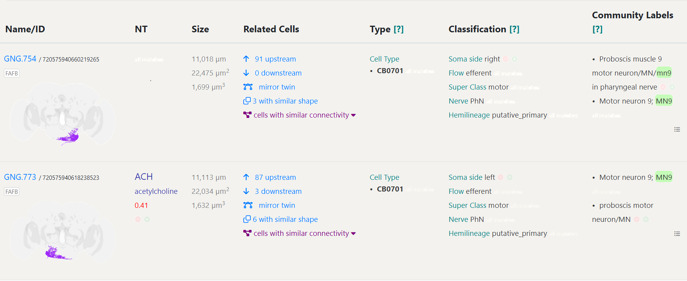
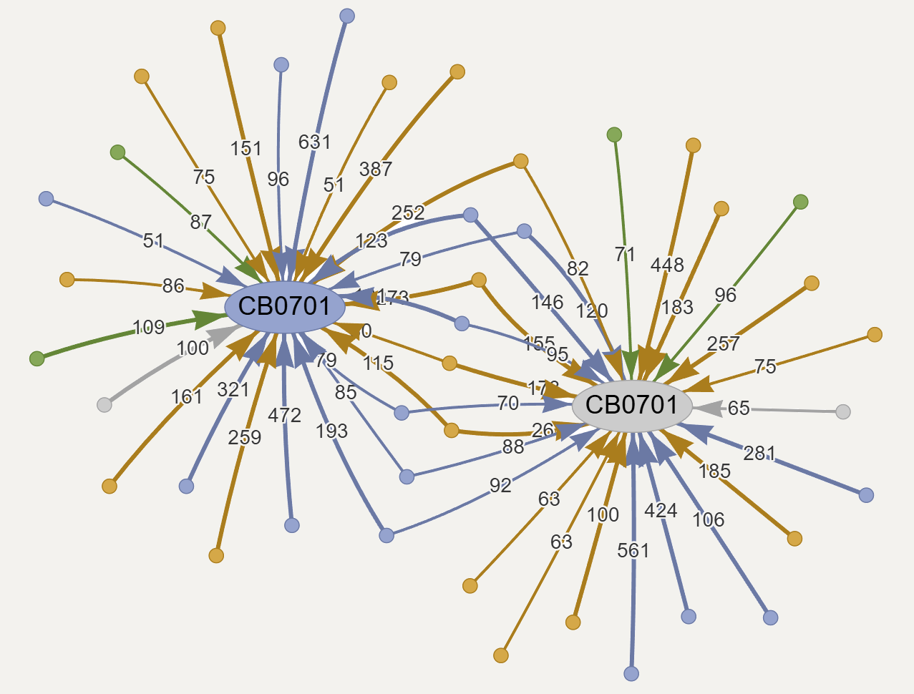

# Read Notes: Computational brain model reveals sensorimotor processing

Here are linshey's Read Notes for <Shiu, P.K., Sterne, G.R., Spiller, N. *et al.* A *Drosophila* computational brain model reveals sensorimotor processing.[^1]>.

## FlyWire: brain connectome

FlyWire[^2] is a neuronal wiring diagram of a whole adult female Drosophila  melanogaster brain containing $5\times 10^7$ chemical  synapses between $139,255$ neurons reconstructed from an adult female Drosophila melanogaster. The resource also incorporates annotations of cell classes and types,  nerves,  hemilineages and predictions of neurotransmitter identities.

The connectome data is free accessible on Codex Website ([https://codex.flywire.ai/](https://codex.flywire.ai/)). To better showcase the usage of the incredible website, I'll search "MN9" (Proboscis muscle 9 motor neuron) in this website for example.

The neuron named [GNG.754](https://codex.flywire.ai/app/cell_details?data_version=783&root_id=720575940660219265) and [GNG.773](https://codex.flywire.ai/app/cell_details?data_version=783&root_id=720575940618238523) are listed with their (predicted) NT Types (ACH), Cell Types (CB0701), Connectivity (upstream and downstream partners), Annotations (side, flow, super class, nerve, hemilineages), Community Labels ("motor neuron 9").

As for computational model, the most critical data is the Network Graphs (see [https://codex.flywire.ai/app/connectivity](https://codex.flywire.ai/app/connectivity)), which shows the connectome as a directed graph (edges weighted by syn_count and nt_type).

| pre_root_id        | post_root_id       | neuropil | syn_count | nt_type  |
| ------------------ | ------------------ | -------- | --------- | -------- |
| 720575940629970000 | 720575940629970000 | AVLP_R   | 7         | GABA     |
| 720575940629970000 | 720575940629970000 | SLP_R    | 4         | GLUT     |
| 720575940629970000 | 720575940629970000 | SMP_R    | 2         | ACH      |
| 720575940629970000 | 720575940629970000 | SMP_L    | 2         | GLUT     |
| 720575940629970000 | 720575940629970000 | LAL_R    | 15        | GABA     |
| $\cdots$           | $\cdots$           | $\cdots$ | $\cdots$  | $\cdots$ |

## Leaky integrate-and-fire model[^1]

To model the neural circuit mechanisms that generate behaviour,  they implement a simple leaky integrate-and-fire model using the connection weights derived from the FlyWire, as well as neurotransmitter predictions for each neuron. In this model,  spiking of a neuron alters the membrane potential of downstream  neurons in proportion to the connectivity from the upstream neuron; if a downstream neuron’s membrane potential  reaches the firing threshold, that neuron, in turn, fires.

### Definition of variables

Click here to see defs of variables.

$V_{\textrm{resting}} = −52\textrm{ mV}$: resting potential from Kakaria. and de Bivort[^3].
$V_{\textrm{reset}} = −52 \textrm{mV}$: reset potential after spike[^3].
$V_{\textrm{threshold}} = −45 \textrm{mV}$: threshold for spiking[^3].
$R_{\textrm{mbr}} = 10 \textrm{Kohm cm}^2$: membrane resistance[^3].
$T_{\textrm{refractory}} = 2.2 \textrm{ms}$: refractory period[^3][^4].
$C_{\textrm{mbr}} = 2 \mu\textrm{F cm}^{-2}$: membrane capacitance[^3].
$T_{\textrm{mbr}} = C_{\textrm{mb}} × R_{\textrm{mbr}}$: definition of membrane timescale in a resistor capacitor circuit.
$\tau=5\mathrm{ms}$: synapse decay timescale[^5].
$T_{\textrm{dly}} = 1.8 \textrm{ms}$: time delay from spike to change in membrane potential[^6]. 
$W_{\textrm{syn}} = 0.275 \textrm{mV}$: free parameter; synaptic weight, that is, how much  each synapse influences downstream membrane potential.
$g_i$: the synaptic conductance resulting from the aggregate firing of  neurons presynaptic to neuron $i$.
$v_i$: the membrane potential of neuron $i$, decays back to $V_{\textrm{resting}}$, the resting potential, in the absence of any stimulus. If an upstream neuron, $j$, fires, the membrane potential changes in proportion to the connectivity ($w_{j,i}$) neuron is excitatory, the neuron depolarizes; if inhibitory, the neuron hyperpolarizes.
$w_{j,i}$: between neuron $j$ and neuron $i$ is the synaptic connectivity weight from the Flywire connectivity multiplied by either $1$, if neuron $j$ is excitatory or $−1$, if neuron $j$ is inhibitory, multiplied by $W_{\textrm{syn}}$ .

### Computational process: $α$-synapse modelling

Upon firing of the upstream neuron, the conductance variable $g_i$ is revised: $g_i$ becomes $g_i + w_{j,i}$. $g_i$, upon initialization of the network, or after firing of the neuron, starts at $0 \textrm{mV}$. Because the membrane potential dynamics are defined by:
$$
\frac{\mathrm{d}v_i}{\mathrm{d}t}=\frac{g_i-(v_i-V_{\mathrm{resting}})}{T_{\mathrm{mbr}}}
$$
A change in $g_i$ changes the potential that the neuron will now decay towards. Furthermore, $g_i$ exponentially decays with the timescale of $\tau$:
$$
\frac{\mathrm{d}g_i}{\mathrm{d}t}=-\frac{g_i}{\tau}
$$
Therefore, after an initial change in membrane potential, once $g_i$ decays back towards $0$, the membrane potential again decays back to the resting potential. Upon firing, a neuron’s membrane potential is reset to the resting potential, and cannot change for the duration of  the refractory time period.

Some particular neurons were stimulated with Poisson distributed input. 30 simulations of 1,000 ms for each experiment (see the following part of this note) were performed. Simulation of sugar neuron activation takes approximately $5 \mathrm{min}$ per $1,000 \textrm{ms}$ trial per CPU thread. All $127,400$ proofread neurons from FlyWire materialization v.630 are included in the model (up to 20241130, the number of proofread cells has come to 139,255).

### Some limitations of computational modeling  

1. Neurons are modeled explicitly either excitatory or inhibitory spiking neurons.
2. Neural morphology and  receptor dynamics are ignored.
3. The basal firing rate is assumed as 0 Hz, resulting that inhibitory connections to an inactive neuron have  no effect.
4. Circuits with extensive neuromodulation or extrasynaptic signaling will be poorly modeled. 

##  Feeding initiation circuit

Drosophila feeding initiation was selected for testing the computational model, due to its well-defined taste sensory inputs (GRNs have been identified in EM volume before[^7]) and motor outputs (MNs[^8]).

Gustatory receptor neurons (GRNs) on the body surface of the fly, including the labellum (tip of the proboscis) or the legs, respond directly to tastants and project to the primary taste center of the insect brain—the  suboesophageal zone (SEZ)[^7]. Four GRN categories was focused:  sugar, water, bitter and a fourth GRN category labeled by the ionotropic receptor Ir94e. When a fly encounters sugar, activation of appetitive GRNs results in  activation of proboscis motor neurons (MNs). The activity of MN9 was specifically focused, which controls rostrum lifting during proboscis extension, permitting quantification of MN9 activity by measuring rostrum lifting[^8].

### Circuit activity of [sugar GRN stimulation $\rightarrow$ MN9]

They conducted computational prediction of cell types composing feeding initiation circuit, by examining network activity upon sugar GRN activation ranging from 10 to 200 Hz. The computational model predicts a large network activated by sugar taste detection that includes known[^9] sugar-responsive MNs.

Each of the top sugar-responding neurons was computationally stimulated to identify those that drive activity in MN9. Then, they computationally activated sugar GRNs when silencing each of the top 200 sugar-responsive neurons one at a time, and measured the change in predicted MN9 firing. When MN9 firing is decreased by $>20\%$, the neuron is declared to cause a silencing phenotype. Previous experimental studies identified ten neural classes that respond to sugar, and are sufficient for proboscis extension. The computational model correctly predicts that all ten cell types respond to sugar (identified in previous experiments), and eight of them to be sufficient to activate MN9.

Some biological experiments were also conducted to test the findings:

1. A cell-specific knockdown of the gene *Amontillado*, to test whether the Usnea cell is neuropeptidergic.
2. Optogenetic behaviour experiments: optogenetically activation of individual neuronal cell types with split-GAL4 lines and monitoring of the activity of MN9, to independently assess the model accuracy.
3. Calcium imaging, to test the computational conclusion that bitter GRN activation inhibits the sugar pathway at the level of pre-MNs.

### Circuit activity caused by Ir94e, bitter and water 

The computational model correctly predicts that bitter/Ir94e neurons are aversive, consistent with optogenetic experiments. According to the model prediction, Strong bitter activation eliminates MN9 firing to strong sugar stimula tion, but strong activation of Ir94e neurons does not. Optogenetically bitter/Ir94e activation supports the prediction.

To identify interneurons that compose the water feeding initiation circuit, they utilized similar methodologies as the identification of the sugar feeding initiation circuit (simulated activation of GRN or water-responsive neurons, silencing, calcium imaging and Optogenetical experiments).

The computational model predicts that the water and sugar pathways share a common set of neurons, and activation of water and sugar GRNs work synergistically to promote MN9 firing, consistent with optogenetic behavior experiments.

### Deviations between computations and experiments

1.  The model fails to  correctly predict that the Phantom cell type will activate MN9, probably because of the basal $0$ firing rate or because of ignoring neuromodulation.
2. Bract and Roundup are predicted to respond to both sugar and water, but they did not respond to water in previous calcium imagine. This discrepancy may reflect the greater sensitivity of the behavioral silencing experiments compared with calcium imaging of water responses
3.  Usnea was incorrectly predicted to respond to sugar. The *Amontillado* RNAi experiments  indicate that it may be neuropeptidergic.

## Antennal grooming circuit

To test the general applicability of the computational model to study sensorimotor processing, they sought to predict circuit properties in another system—the well-studied antennal grooming circuit. The method are similar to that applied to feeding initiation circuit. As a result, the computational model correctly identifies key neurons in the antennal grooming circuit as well as subtype circuit responses. 

## Conclusion

These studies demonstrate the power of computational modeling to explain sensory processing features in complex networks. It is believed that computational model will be a useful tool for the study of sensorimotor transformations and the exploration  of interactions between overlapping neural pathways.

[^1]: Shiu, P.K., Sterne, G.R., Spiller, N. *et al.* A *Drosophila* computational brain model reveals sensorimotor processing. *Nature* **634**, 210–219 (2024). https://doi.org/10.1038/s41586-024-07763-9
[^2]: Dorkenwald, S., Matsliah, A., Sterling, A.R. *et al.* Neuronal wiring diagram of an adult brain. *Nature* **634**, 124–138 (2024). https://doi.org/10.1038/s41586-024-07558-y
[^3]: Kakaria, K. S. & de Bivort, B. L. Ring attractor dynamics emerge from a spiking model of the entire protocerebral bridge. *Front. Behav. Neurosci.* **11**, 8 (2017).
[^4]: Lazar, A. A., Liu, T., Turkcan, M. K. & Zhou, Y. Accelerating with FlyBrainLab the discovery of the functional logic of the *Drosophila* brain in the connectomic and synaptomic era. *eLife* **10**, e62362 (2021).
[^5]: Jürgensen, A.-M., Khalili, A., Chicca, E., Indiveri, G. & Nawrot, M. P. A neuromorphic model of olfactory processing and sparse coding in the *Drosophila* larva brain. *Neuromorph. Comput. Eng.* **1**, 024008 (2021).
[^6]: Paul, M. M. et al. Bruchpilot and synaptotagmin collaborate to drive rapid glutamate release and active zone differentiation. *Front. Cell. Neurosci.* **9**, 29 (2015).
[^7]: Engert, S., Sterne, G. R., Bock, D. D. & Scott, K. *Drosophila* gustatory projections are segregated by taste modality and connectivity. *eLife* **11**, e78110 (2022).
[^8]: McKellar, C. E., Siwanowicz, I., Dickson, B. J. & Simpson, J. H. Controlling motor neurons of every muscle for fly proboscis reaching. *eLife* **9**, e54978 (2020).
[^9]: Shiu, P. K., Sterne, G. R., Engert, S., Dickson, B. J. & Scott, K. Taste quality and hunger interactions in a feeding sensorimotor circuit. *eLife* **11**, e79887 (2022).
