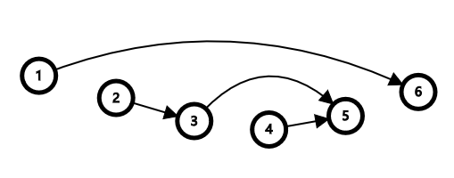
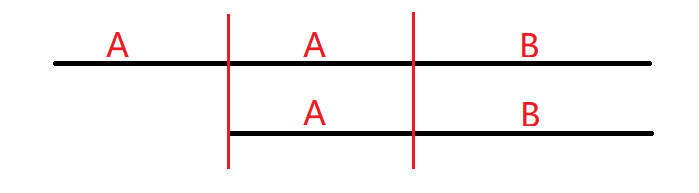
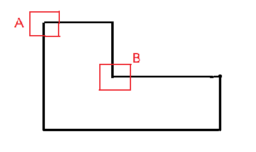

# YAIU 非官方营业日志（1、2、3）

### [P6383     『MdOI R2』Resurrection   ](https://www.luogu.com.cn/problem/P6383)

#### 题面：

> 有一棵包含 $n$ 个节点的树 $T$，它的所有边依次编号为 $1$ 至 $n-1$。
>
> 保证对于 $T$ 中任意一个节点 $u$ ，从 $u$ 到 $n$ 号节点的简单路径都不经过任何编号小于 $u$ 的节点。
>
> 按照如下步骤生成一张包含 $n$ 个节点的无向图 $G$：
>
> 选取一个 $1 \sim n-1$ 的排列 $p$，然后依次进行 $n-1$ 次操作。在进行第 $i$ 次操作时，首先删除树 $T$ 中编号为 $p_i$ 的边 $(a,b)$，然后，记 $u$ 和 $v$ 分别为当前树 $T$ 中与 $a,b$ 联通的所有点中，编号最大的点，并在图 $G$ 的 $u$ 号点和 $v$ 号点之间连一条边。
>
> 求对于给定的树 $T$，按上述方式一共可以生成多少种本质不同的图 $G$。图 $G_1$ 和 $G_2$ 本质不同当且仅当存在 $u$ 和 $v$ 满足在 $G_1$ 中不存在边 $(u,v)$，而 $G_2$ 中存在。 
>
> 因为答案可能很大，你只需要求出答案对 $998244353$ 取模的值。$n\le 3000$。

#### 题解：

删去边 $(u,v)$ 时（不妨设 $u=fa_v$），连的那条边，必然以 $v$ 为其端点之一；这条边，只能向其祖先连过去。

考虑链的情况，玩一下，发现图应该长如下这样：

也就是不能相交。证明的话，如果有相交的，显然无解；如果没有相交的，我们直接递归构造。搬到树上也一样的，我们只要数这种连边方式的数量。

那么怎么数呢？树形 `dp` 有一个惯性是，设 $dp_{u,S}$ 表示 $u$ 子树内，对上方节点的后效性为 $S$ 的方案数；在这题中，这个 $S$ 需要存下向上所有的连边方案，这是行不通的。

我们反过来记录，记下上面对下面的影响。具体来说，我们记 $f_{u,i}$ 表示，如果上方还有 $i$ 个点可选（没有被已有的线挡住），$u$ 子树内的方案数。那么就很可做了，得到状态转移方程：
$$
f_{u,i}=\sum_{j=1}^{i}\prod_{v\in son_u}f_{v,i-j+2}
$$
[**AC Submision Click Here!**](https://www.luogu.com.cn/problem/P6383)

### [CF1592F2     Alice and Recoloring 2   ](https://www.luogu.com.cn/problem/CF1592F2)

#### 题面：

>有一个 $n\times m$ 的 `01` 矩阵和四种操作：
>
>1. 对包含 $(1,1)$ 的一个子矩形作区间翻转，代价为 $1$。
>2. 对包含 $(n,m)$ 的一个子矩形作区间翻转，代价为 $2$。
>3. 对包含 $(1,m)$ 的一个子矩形作区间翻转，代价为 $3$。
>4. 对包含 $(n,1)$ 的一个子矩形作区间翻转，代价为 $4$。
>
>问把一个全 $0$ 矩阵转换成一个给定矩阵的最小代价。$n\le 300$。

#### 题解：

首先我们发现第三、四种操作没有任何作用，都可以换成两个一操作。对原平面做一次二维差分（以 $(n,m)$ 为原点），那么一操作就是一次单点翻转，二操作就是一次四点翻转。

这时一个重要结论是，每一行/列最多被进行一次二操作。否则就会有一半的单点修改没有用，可以直接用一操作来替代，代价不升。一次二操作，只有当 $del_{u,v}=1$ 且 $del_{u,m}=1$ 且 $del_{n,v}=1$ 时，才会对答案起到减一的作用。对于每个满足这个条件的 $(u,v)$，从行 $u$ 连一条边向 $v$。直接跑二分图最大匹配即可。

点 $(n,m)$ 的影响怎么处理？由于一的代价恰好可以忽略/抵消，我们直接不管它，最后单独判一下即可。$O(n^3)$，[**AC Submision Click Here!**](https://www.luogu.com.cn/record/60958142)

### [P5332     [JSOI2019]精准预测   ](https://www.luogu.com.cn/problem/P5332)

#### 题面：

>目前，火星小镇上有 $n$ 个居民（编号 $1,2,……,n$）。机器学习算法预测出这些居民在接下来 $T$ 个时刻（编号$1,2,……,T$）的生死情况，每条预测都是如下两种形式之一：
>
>- 难兄难弟$0$ $t$ $x$ $y$：在 $t$ 时刻，如果$x$是死亡状态，那么在 $t+1$ 时刻，$y$ 是死亡状态。（注意，当 $x$ 在 $t$ 时刻是生存状态时，该预测也被认为是正确的）；
>
>- 死神来了$1$ $t$ $x$ $y$：在 $t$ 时刻，如果 $x$ 是生存状态，那么在 $t$ 时刻，$y$ 是死亡状态。（注意，当 $x$ 在 $t$ 时刻是死亡状态时，该预测也被认为是正确的）。
>
>对于每个人，计算出有多少个人有可能和它一起活到 $T+1$ 时刻。$n\le 50000$，预测条数 $\le 10^5$。

#### 题解：

对于每个人的每个有效时刻建出两个虚点，显然可以建出一颗 `2-SAT`。（这里插一句，对于一个限制 $u\rightarrow v$ 别忘了 把 $\bar v\rightarrow\bar u$ 连上，因为这个事调了我好久啊啊啊啊啊）。

那么容易想到的一个结论是，$u$ 和 $v$ 可以共存，当且仅当 $u\not\rightarrow\bar u$ 且 $v\not\rightarrow\bar v$ 且 $u\not\rightarrow\bar v$。前两个条件是保证两个分别有解；第三个条件是保证能共存。直接 `bitset` 传递闭包即可，$O(\frac {nm}w)$。

为了空间限制，要分成多个部分分别传递闭包，时间复杂度大体不变；每个点不需要建出其第 $T+1$ 时刻。这样就能卡过去了：[**AC Submision Click Here!**](https://www.luogu.com.cn/record/60999927)

###  [CF932F     Escape Through Leaf   ](https://www.luogu.com.cn/problem/CF932F)

#### 题面：

> 有一颗 $n$ 个节点的树（节点从 $1$ 到 $n$ 依次编号）。每个节点有两个权值，第 $i$ 个节点的权值为 $a_i,b_i$。
>
> 你可以从一个节点跳到它的子树内任意一个节点上。从节点 $x$ 跳到节点 $y$ 一次的花费为 $a_x\times b_y$。跳跃多次走过一条路径的总费用为每次跳跃的费用之和。请分别计算出每个节点到达树的每个叶子节点的费用中的最小值。
>
> 注意：就算树的深度为 $1$，根节点也不算做叶子节点。另外，不能从一个节点跳到它自己.
>
> $2\leq n\leq 10^5$，$-10^5\leq a_i\leq 10^5$，$-10^5\leq b_i\leq 10^5$。

#### 题解：

从一个 $a=x$ 的点向 $u$ 的子树跳，到根的最小代价是一个关于 $x$ 的一个一次函数构成的下凸壳。我们要做的就是动态维护半平面交合并和单点插入。我们直接李超树合并，复杂度是 $O(n\log n)$ 的；因为每条直线只会从根一路传递到叶子，均摊一下复杂度就是 $O(n\log n)$ 的了。[**AC Submision Click Here!**](https://www.luogu.com.cn/record/61022397)

###  [P5334     [JSOI2019]节日庆典   ](https://www.luogu.com.cn/problem/P5334)

#### 题面：

> 对于字符串，定义
>
> $$
> T_i=T[i……|T|]::T[1……i-1](1 \leq i \leq |T|)
> $$
> 其中 $::$ 是字符串的拼接操作。定义 $f(T)$ 为最小的 $i$（$1 \leq i \leq |T|$）满足 $T_i=min(T_1,T_2,……,T_{|T|})$（字典序意义下）。
>
> JYY希望你帮助他设计一个算法，让火星人每个节目的气球排列都最美观，即对于给定字符串 $S$ 的每一个前缀$S[1……i]$（$1 \leq i \leq |S|$），求出 $f(S[1……i])$。

#### 题解：

感觉是一个比较典型的字符串的推导过程。

我们从左到右依次考虑，设 $1\sim i$ 的答案候选集合为 $S$。将其从小到大排序，由最小性得 $T[S_{j+1},i]$ 是 $T[S_{j},i]$ 的一个 `Border`；如何使限制更加严格呢？设 $|S_{j+1}|\cdot 2 > |S_j|$，大概会长下面这个样子：

其中，$B$ 是 $A$ 的一个 `Border`，也是候选集和中的一个元素；容易发现，`ABX` 一定不会比 `AABX` 和 `BX` 都优秀，那么这个 `ABX` 就没有用了。加上这个剪枝，候选集合的大小就是 $O(\log{n})$ 级别的了。

维护候选集合直接从左到右暴力地做就好了；那么如何从候选集合中找到答案呢？这就需要快速比较字典序了。由于循环位移比较字典序中需要比的串对中，至少得有一个是前缀，所以可以用 `exKMP`，求出每个后缀与全串的 `lcp`，就能 $O(1)$ 比较字典序啦！[**AC Submision Click Here!**](https://www.luogu.com.cn/record/61033743)

###  [P5597     [XR-4]复读   ](https://www.luogu.com.cn/problem/P5597)

#### 题意：

> 小 X 捡到了一台复读机，这台复读机可以向机器人发号施令。机器人将站在一棵完全二叉树的根上，完全二叉树是无限延伸的。你将向复读机录入一串指令，这串指令单个字符可以是：
>
> * `L`：命令机器人向当前节点的左子走；
> * `R`：命令机器人向当前节点的右子走；
> * `U`：命令机器人向当前节点的父亲走（若没有，则命令非法）。
>
> 录入指令后，复读机将会把指令无限复读下去。比如命令为 `LR`，那么机器人会遵从 `LRLRLRLR...` 一直走下去。
>
> 这棵完全二叉树上有一个 $n$ 个节点的连通块，保证这个连通块包含根节点。连通块上的每个节点都埋有宝藏，机器人到达过的地方如果有宝藏，则会将其开采。如果一个地方没有宝藏，机器人也可以到那里去。机器人也可以反复经过一个地方。
>
> 显然，这个连通块本身也是一棵二叉树。
>
> 现在，有人告诉了小 X 埋有宝藏的这棵二叉树的前序遍历，小 X 需要寻找到一条尽量短的指令，使得机器人能够挖掘出所有宝藏。

#### 题解：

枚举一个周期的位移矢量，然后会把原树分成很多段，求个并即可。没什么好解释的，就是码就好了。[**AC Submision Click Here!**](https://www.luogu.com.cn/record/61092791)

###  [P3293     [SCOI2016]美味   ](https://www.luogu.com.cn/problem/P3293)

#### 题面：

> 一家餐厅有 $n$ 道菜，编号 $1,2,...,n$ ，大家对第 $i$ 道菜的评价值为 $a_i$。有 $m$ 位顾客，第 $i$ 位顾客的期望值为 $b_i$，而他的偏好值为 $x_i$。因此，第 $i$ 位顾客认为第 $j$ 道菜的美味度为 $b_i\,\,xor\,\, (a_j+x_i)$，$xor$ 表示异或运算。
>
> 第 $i$ 位顾客希望从这些菜中挑出他认为最美味的菜，即美味值最大的菜，但由于价格等因素，他只能从第 $l_i$ 道到第 $r_i$ 道中选择。请你帮助他们找出最美味的菜。

#### 题解：

我们建出可持久化值域线段树，用于查询一个区间内是否存在值域在某个范围内的数。然后我们从高到低位考虑，每次查的都是一个区间，逐渐缩小范围，直到确定这个数。$O(\log^2n)$。[**AC Submision Click Here!**](https://www.luogu.com.cn/record/61097799)

###  [P4898     [IOI2018] seats 排座位   ](https://www.luogu.com.cn/problem/P4898)

#### 题面：

> 你要在一个长方形大厅里举办国际编程比赛，该大厅共有 $HW$ 个座位（$H$ 行 $W$ 列）。行的编号是从 $0$ 到 $H-1$，列的编号是从 $0$ 到 $W-1$。位于 $r$ 行 $c$ 列的座位用 $(r,c)$ 表示。一共邀请了 $HW$ 位参赛者，编号是从 $0$ 到 $HW-1$。你制定好了一个座位表，第 $i(0 \leq i \leq HW - 1)$ 个参赛者被安排到座位 $(R_i,C_i)$。座位表中参赛者和座位是一一对应的。
>
> 大厅中一个座位集合 $S$ 被称为是**长方形的**，如果存在整数 $r_1, r_2, c_1$ 和 $c_2$ 满足下列条件：
>
> - $0 \leq r_1 \leq r_2 \leq H - 1$。
> - $0 \leq c_1 \leq c_2 \leq W - 1$。
> - $S$ 正好是所有满足 $r_1 \leq r \leq r_2$ 和 $c_1 \leq c \leq c_2$ 的座位 $(r, c)$ 的集合。
>
> 如果一个长方形座位集合包含 $k(1 \leq k \leq HW)$ 个座位，并且被分配到这个集合的参赛者的编号恰好是从 $0$ 到 $k-1$，那么该集合是**美妙的**。一个座位表的**美妙度**定义为这个表中美妙的长方形座位集合的个数。
>
> 在准备好座位表后，你会收到一些交换两个参赛者座位的请求。具体来说，有 $Q$ 个这样的请求，按时间顺序编号为 $0$ 到 $Q-1$。第 $j(0 \leq j \leq Q - 1)$ 个请求希望交换参赛者 $A_j$ 和 $B_j$ 的座位。你立即接受每个请求并更新座位表。每次更新后，你的目标是计算当前座位表的美妙度。

#### 题解：

在 `Chen_03` 的循循善诱下做出了这道题。

先考虑只有一列的情况。我们肯定是要对人的编号为下标的序列维护一个什么东西，这个东西能够判定是否连通且能方便地求和。设 $ps_i$ 为第 $i$ 个人的位置，那么我们判断 $1\sim i$ 能构成美妙集合当且仅当：
$$
\sum_{j=1}^i 1-[a_{ps_i-1}<i]=1
$$
我们建一个以人的编号为下标的线段树，维护每个 $\sum_{j=1}^i 1-[a_{ps_i-1}<i]$；考虑插入一个数作为 $a_{ps_i-1}$ 的贡献，那么它对应着一个区间加。统计最小值个数即可。

二维情况怎么办？如下：

我们直接统计 $A$ 的数量和 $B$ 的数量；$B$ 必须一个都没有，权值设为 $5$；$A$ 必须有恰好 $4$ 个，权值设为 $1$，直接维护一个编号上的线段树即可。

