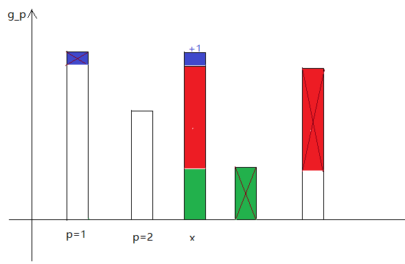

| 编号 | 题目                                                     | 进展            | done |
| ---- | -------------------------------------------------------- | --------------- | ---- |
| 1    | [UR #25 装配序列](https://uoj.ac/contest/82/problem/807) | [Link](#table1) | √    |
| 2    |                                                          |                 |      |
| 3    |                                                          |                 |      |
| 4    |                                                          |                 |      |
| 5    |                                                          |                 |      |
| 6    |                                                          |                 |      |
| 7    |                                                          |                 |      |
| 8    |                                                          |                 |      |
| 9    |                                                          |                 |      |
| 10   |                                                          |                 |      |
| 11   |                                                          |                 |      |
| 12   |                                                          |                 |      |
| 13   |                                                          |                 |      |
| 14   |                                                          |                 |      |
| 15   |                                                          |                 |      |
| 16   |                                                          |                 |      |
| 17   |                                                          |                 |      |
| 18   |                                                          |                 |      |
| 19   |                                                          |                 |      |
| 20   |                                                          |                 |      |

### <a id="table1">1. 装配序列 </a>

叹服，叹服，实在是叹服。

首先它求的东西相当于严格最长上升子序列长度。

考虑一般的 LIS 求法是，$i$ 从小到大逐渐考虑每一个 $a_i$，动态维护一个 $f_x$ 表示长度为 $x$ 的上升子序列最后一个元素最小是多少，然后逐渐维护。而这题中，**值域远小于下标，所以应该反转下标和值域**。

具体来说，我们逐渐考虑每个 $a_x=i$，那么势必所有 $a_{x+jn}=i$，我们按照 $j$ 从大到小考虑 $x+jn$，逐渐插入 $f_y$ 中：找到最小的 $f_y>x+jn$，令 $f_y\leftarrow x+jn$。

进一步考察这个 $f$ 的变化的形式，设 $f_y=p_y+q_yn$，它以 $q_y$ 为第一关键字，我们首先按照 $v_y=q_y+[p_y>x]$ 从大到小考虑每个 $v$，它一定是替换 $(q_y-x+n)\bmod n$ 最小的一个。

归纳地：对于相同的 $p$，保留的 $q$ 一定是一个前缀，不妨设 $g_p$ 表示 $p$ 对应的 $q$ 为 $1\sim g_p$，也就是说，$p+qn\in \{f\} \leftrightarrow q\le g_p$，以及，$f$ 也就相当于所有 $p+qn(q\le g_p)$ 数组的归并。

我们如果用柱状图来画：

实际上，相当于是逐渐把 $g_x$ 与它右侧大于它的数交换，其中 $p<x$ 后，需要先减一后加一（一些细节）。

考虑怎么快速维护，设 $B=n^{0.5}$，对于 $g_x\le B$，每种 $g$ 开一个 set 维护；其它暴力。

考虑分析其复杂度：设 $d_g$ 表示每种 $g$ 的数量，那么 $\sum gd_g\le n$，那么 $\sum \log(d_i+1)\le \sum_i\sum_j[d_i\ge 2^j]\sim \sum_j\sqrt{2n/2^j}\sim O\left(n^{0.5}\right)$。

